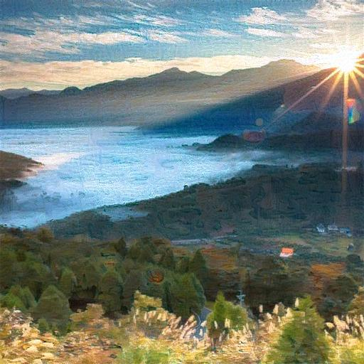

#  基于Pytorch的图像风格迁移（Image Style Transfer）
***

## 1. 开发环境

**Pytorch + cuda11.8**  


## 2. 使用方法

在input目录下存放原图片（content.jpg）和风格图片（style.jpg）：
```text
input/
    content.jpg: the original image you want to transfer
    style.jpg: the style image
```
运行run.py即可开始生成结果。
```shell
python run.py
```

## 3. 参数配置

可以在run.py中修改训练参数，
```python
epochs = 10
steps_per_epoch = 100
learning_rate = 0.001
```

如果希望生成风格特征更明显的图像，可以在train.py中提高权重w2，
```python
# 内容损失权重和风格损失权重
w1, w2 = 1.0, 1000.0
```

## 4.效果展示

原图片：


风格图片：


生成图片：
